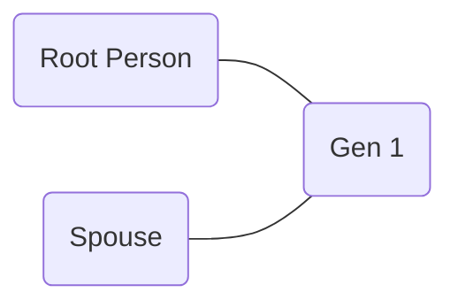

# Some ideas for this notebook

### Tested

- Make an entirely new ‘7’ that’s just a horizontal line and a vertical. This will have no traces of the original “1”
- Take existing ‘7’ image and remove the top line to turn into ‘1’ and see what outputs are
- 

---

### Untested

- 

---

